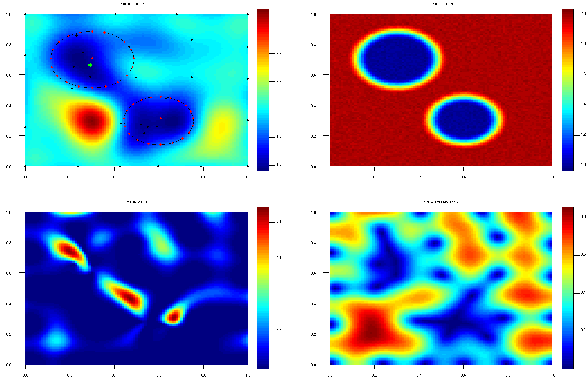

# Active Exploration Strategy for Tumor Localization in Robot-Assisted Surgery Using Bayesian Optimization
Robot-assisted minimally invasive surgery (RMIS) has become increasingly popular
in the resection of cancers. However, the lack of tactile feedback in clinical RMIS limits the
surgeon’s haptic understanding of tissue mechanics, making it hard to detect tissue abnormalities
(e.g., tumors) efficiently. This project will use Gaussian Processes (GP) to model the stiffness
distribution and develop an active exploration strategy to autonomously guide the robot to localize
the tumor profile via robot palpation using Bayesian Optimization (BO). Compared to exhaustively
palpating the entire organ to achieve tumor localization, the proposed framework aims at improving
efficiency with minimum times of exploration. Simulation and comparison experiments will be
conducted to verify the performance of the proposed strategy.


The localization can be run in two different modes. The first option, which offers full functionality, can be accessed by installing and compiling the source code on your local machine. If you prefer not to run the code on your host machine, you can run the code inside a Docker container. Computation results will be written to the host machine through a mount point.
# 1. Run on your local machine
## Installation
### 1. Install dependencies 
For Ubuntu/Debian, the minimum dependencies (C/C++) can be optained by running: 
```
sudo apt-get update
sudo apt install  cmake g++ build-essential
sudo apt install libboost-dev freeglut3-dev libcgal-dev libomp-dev libarmadillo-dev libensmallen-dev libglu1-mesa-dev freeglut3-dev mesa-common-dev  libstb-dev 
```
Navigate to a desired install location for cereal library and run the following command:
```
sudo wget https://github.com/USCiLab/cereal/archive/refs/tags/v1.1.2.tar.gz \
    && tar -xzf v1.1.2.tar.gz \
    && sudo mkdir -p /usr/local/include/cereal \
    && sudo cp -r cereal-1.1.2/include/cereal/* /usr/local/include/cereal/

sudo apt install libmlpack-dev 
```
The required BayesOpt C++ library to perform Bayesian optimizaiton needs to be cloned to a convenient location and build. 
Install required dependencies:
NLopt - Library
```
git clone https://github.com/stevengj/nlopt.git
cd nlopt
mkdir build
cd build
cmake ..
make
sudo make install

```
To install the BayesOpt library, run:
```
git clone https://github.com/rmcantin/bayesopt
cd bayesopt
cmake . 
make
sudo make install
```

### 2. Clone repository
Clone repository and build the package.
```
git clone https://git.tu-berlin.de/raphael/bo_robotic_palpation
cd bo_robotic_palpation
mkdir build && cd build
cmake ..
make
```
## Using the package 
### 1. Configure Tumor Model Parameters
Four different shapes are pre-programmed, and shape attributes can be adjusted to test the robustness of the algorithm. Inside /config/tumor_model_parameters.txt, you will find a set of pre-defined parameters for four different shapes including a Triangle, Rectangle, Circles, and a Two Circle configuration. All shapes share a set of common parameters which are:
-   Low and high stiffness values
-   Translation in x and y,
-   Size defined by radius,
-   Epsilon (defines how smooth values transition from high to low stiffness areas)
-   Noise to simulation measurement error (gaussian and zero mean).

### 2. Configure Bayesian Optimization Parameters
Approximation of a posterior distribution is done by iteratively probing the tumor model and updating a Gaussian process. A detailed description of parameters can be found in the documentation of the BayesOpt library: http://rmcantin.github.io/bayesopt/html/usemanual.html#params
### 3. Configure Contour Parameters
Once a posterior distribution is found the contour of the tumor is approximated. This is done by first running a means shift clustering algorithm on a sampled representation of the posterior. In a second step the computed centroids are explored in radial direction.

More precisely, the algorithm will start exploring centroids by probing a set of pre-defined planar directions. Each direction is explored until the tumor stiffness is changing and a threshold criterion is met. Directions are computed by defining angle segments along which the algorithm explores the centroids. Angle segments are pre-defined by a parameter that divides 360°. Once a set of contour points is found, a spline approximation is performed to compute the contour of the tumor.

The following parametes listed in /config/contour_parameters.txt can be tuned to refine the tumor approximation process. 
- n_exploration_directions, defines the number of directions a centroid is explored in
- c_points, granularity of gaussian process. Will define how many points are used in x and y directions
-  means_shift_bandwidth, sets the bandwidth for the means shift algorithm https://github.com/mlpack/mlpack/tree/master/src/mlpack/methods/mean_shift
-   lim_steps, determines the maximum amount of samples that are taken in each direction

-   threshold_multiplier, determines the stiffness threshold. To do so, all previously seen sample stiffnesses are clustered by a k-means algorithm. Given that high stiffness values correlate with tumorous tissue, the cluster with the highest values is selected and its mean value and uncertainty calculated. Based on these measures, the threshold_multiplier parameter will define how many standard deviations from the mean value of the tumor stiffness cluster are categorized as tumor tissue. 

### 2. Run the optimization
The algorithm can be executed with four different tumor models. The algorithm can be simulated with a triangle-, rectangle-, circle and two-circle-shaped tumor model of adjustable size and stiffness.
To run the algorithm, run the following command inside the build directory:
1. Triangle experiment:
```

cd build
./display_gp Triangle
```
2. Rectangle experiment:
```
cd build
./display_gp Rectangle
```
3. Cricle experiment
```
cd build
./display_gp Cricle
```
4. Two-Cricles experiment
```
cd build
./display_gp TwoCricles
```
Press "r" to run the algorithm, press "s" to perform a single step and press "q" to stop it.

# 2. Run in Docker container

The code can be compiled and run from inside a docker container. This is advantageous if you do not want to install the above-listed dependencies. Keep in mind that the current container image does not support graphical user interface (GUI) support which means that the executable display_gp cannot be run. 
## Setup Container
```
cd /bo_robotic_palpation
mkdir build
export BO_PALPATION_WS=$(pwd)
```
```
sudo docker build -f "$BO_PALPATION_WS"/images/Dockerfile -t bo_robotic_palpation "$BO_PALPATION_WS"
```
## Run Container
```
sudo docker run --mount type=bind,source="$BO_PALPATION_WS"/data,target=/usr/src/bo_robotic_palpation/data --mount type=bind,source="$BO_PALPATION_WS"/config,target=/usr/src/bo_robotic_palpation/config -it -t  bo_robotic_palpation
```
Once the prompt opens in the container navigate to the build folder and run the evaluation executable with the desired shape as input.
```
cd build/
./evaluate YOUR_DESIRED_SHAPE
```
## Adjust Parameters
Inside the Dockerfile the config directory is mounted which means that parameters can be tuned from the host machine and changes will be carried over into the container. 
The following parameter files can be adjusted:
```
1. config/bo_parameters.txt  
2. config/contour_parameters.txt  
3. config/tumor_model_parameters.txt
```
Refer to section 1 for more details on parameter tuning. 
## Visualize Data
The results will be written to the host data directory (make sure to not run the following command in the container since visualize.py depends on matplotlib which can't be run inside the container in the current version) and can be visualized through:
```
cd /scripts/
python3 visualize.py YOUR_DESIRED_SHAPE + Number
```

Example: Once a Triangle experiment was evaluated the script can be launched the following way:
```
python3 visualize.py Triangle1

```

